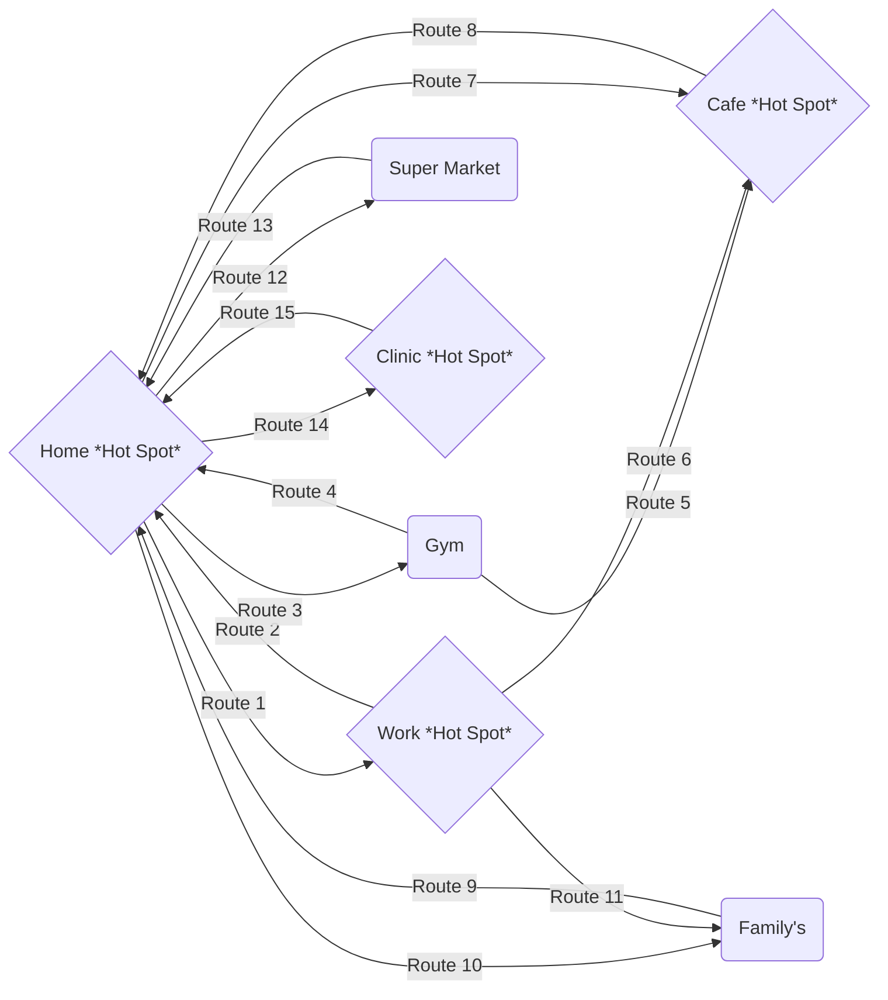

# Patient Contact Tracer

This project aims to help identifying and/or predicting a possible foci for covid-19. 
Given data for a patient or multiple patients, The Project has multiple components

## The following diagram explains movement for an individual between different places

# This project aims to help decision makers identify
- Which areas, roads, neighborhoods The Gov. or military should start disinfecting
- Which areas would develop to be the next disease foci 
- Which hospitals would probably receive more cases

# Main Components

## Trace Generation API

An API that takes a patients most visited locations as input [ home, work, gym. .. etc ] and generates possible trace for the patient movement through routes between those locations, generating geojson response.

## Patient(s) Polygon 
A CSV output file that can be feed into Kepler.gl generating a visualization [ Heat Map ] with patients hotspots and most frequently used routes.

